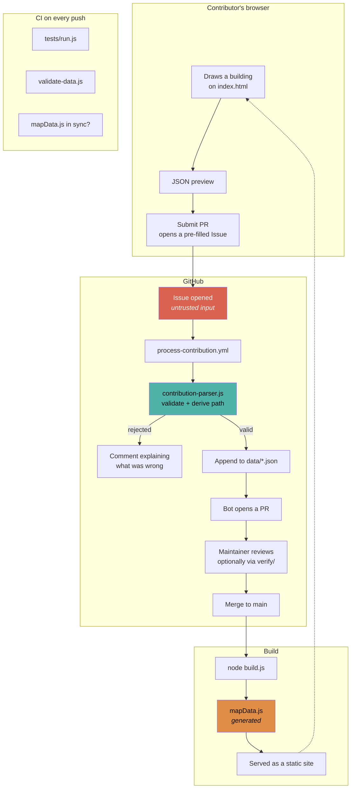
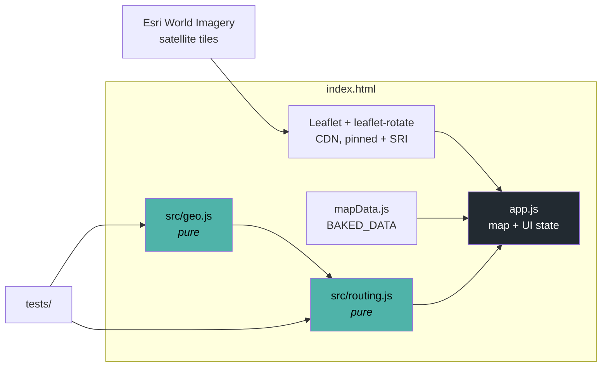

# Campus Mapper

A lightweight, no-backend campus mapping tool for Manipal University Jaipur. Anyone can open it, trace buildings on satellite imagery, and submit their additions as a pull request — a GitHub Action handles the rest. No server, no database, no login. Git is the backend.

## What It Does

**Trace and name every building.** Draw building footprints point-by-point on satellite imagery, tag them by category (Academic, Hostel, Dining, Sports, Admin, etc.), name them, and add floor labels. Buildings aren't anonymous polygons — they carry identity.

**Navigate between places.** Trace walking paths that form a connected network. The route finder snaps to real entry points (doors, gates, track edges) and runs bidirectional Dijkstra over the path graph. Falls back to straight-line if a place is too far from any path.

**Two sites, one map.** College and Hostel are separate views, each with their own boundary, buildings, and path network. Switch between them with a single tap.

**Contribute without friction.** Click Contribute → draw a building or drop a landmark → the JSON preview appears → click Submit PR. A GitHub Issue is pre-filled with the data. A GitHub Action validates it, places the entry in the correct `data/` file, and opens a PR automatically. No manual file editing needed.

**View vs Edit mode.** In view mode, buildings render as small colored dots — clean and uncluttered. Open the Contribute menu and everything switches to edit mode: full polygons, walking paths, and entry markers become visible and interactive.

## Running It

Double-click `index.html`. There is no build step and nothing to install.

**It needs a network connection.** Leaflet loads from a CDN, and the satellite imagery comes from Esri's ArcGIS World Imagery tile service. There is no offline mode — with no network you get a blank map. (An earlier version of this README claimed otherwise.)

To run the test suite, either open `tests/index.html` in a browser, or:

```bash
node tests/run.js     # no npm install — there are no dependencies
```

## Architecture

```
index.html               HTML shell, controls, modals
style.css                All styling (panels, modals, kanban, mobile, a11y)
mapData.js               Generated — the baked data the app reads (window.BAKED_DATA)
app.js                   Leaflet init, drawing tools, UI wiring, map state
src/
  geo.js                 Pure geodesics: distance, bearing, densify, bounds
  routing.js             Graph building, bidirectional Dijkstra, entry pairing
data/                    Source of truth — per-site JSON (auto-managed by the Action)
build.js                 data/ -> mapData.js
parse.js                 KML -> data/
tests/                   Dependency-free suite; runs in Node or a browser
verify/                  Standalone tool for reviewing contributor PRs
.github/
  scripts/
    contribution-parser.js   Pure parsing/validation of an issue body
    process-contribution.js  I/O half: writes data/, emits step outputs
    validate-data.js         CI check over every committed data/ entry
  workflows/                 Contribution processing, CI
```

`src/` holds pure logic — no DOM, no Leaflet, no shared state — which is what
lets the routing engine be tested without a browser. Everything loads as a
plain `<script>`; there is deliberately no bundler, so `file://` keeps working.

### How data flows



### Runtime shape



## Features

### Drawing Tools
- **Boundary** — Rotatable rectangle aligned to campus orientation. Locked to prevent accidental panning outside the site.
- **Buildings** — Click-to-place polygon tracing. Undo points, close by clicking first point or hitting Finish. Name and categorize in a modal after drawing.
- **Landmarks** — Drop named points (courts, blocks, gates). Each can be expanded into a full building trace with one click.
- **Entry Points** — Place real door/gate locations separate from the building centroid. Supports separate points, connected lines, and closed loops (e.g., stadium tracks).
- **Walking Paths** — Trace path segments that snap to existing endpoints within 20m, forming one connected graph. Click existing paths to delete them.

### Routing
- Bidirectional Dijkstra over the traced path network
- Best entry-point pairing (tests all entrance combinations, picks the shortest total walk)
- Densified entry lines so routing treats traced loops as valid entry ground
- Automatic component stitching — disconnected path fragments get bridged with straight-line gaps flagged in the result
- Straight-line fallback when places are too far from any path

Both thresholds that govern this (`JUNCTION_SNAP_METERS`, `CONNECT_THRESHOLD_METERS`) were hand-tuned against this campus's real data. See the note in `src/geo.js` before changing the distance model.

### Map Controls
- **Compass lock** — Fix the bearing so the map always loads at the same rotation
- **Zoom lock** — Lock zoom to a specific level per site (click the badge to set/unlock)
- **Boundary mask** — SVG cutout hides everything outside the drawn boundary
- **Site toggle** — College / Hostel with independent boundaries and views

### Sidebar
- **Kanban building list** — Buildings grouped by category with colored headers
- **Landmark trace queue** — Pending landmarks shown with expand buttons to start tracing
- **Directions** — From/To dropdowns with route display (distance, heading, walk time)

### Mobile
- Collapsible bottom-sheet panel
- Touch-friendly hit targets
- Full-width contribute menu
- Drawing toolbars at bottom of screen

### Theming
- Dark (the original design) and light, toggled from the top-left control
- Follows `prefers-color-scheme` until you make an explicit choice, which is then remembered
- Every colour resolves through a token in `style.css` — there are no raw hex or `rgba()` values outside the two theme blocks
- Every text/background pairing in both themes is measured at WCAG AA or better (worst case 4.52:1)

### Accessibility
- Every control has an accessible name; the Directions selects are labelled
- The site toggle and sidebar tabs expose real state (`aria-pressed`, `aria-selected`) rather than colour alone
- Sidebar tabs support arrow-key navigation
- Route results and drawing status are announced via `aria-live`
- Visible focus indicators throughout, and `prefers-reduced-motion` is honoured
- A skip link bypasses the map's many tab stops

## How to Contribute

See [CONTRIBUTING.md](CONTRIBUTING.md) for the full guide, including how to run the tests and how to regenerate an SRI hash if you bump a CDN dependency.

### Automated Flow (Recommended)
1. Open the map, click **Contribute**
2. Choose **Add Building**, **Add Landmark**, or **Edit Paths**
3. Draw on the map, fill in details
4. Click **Submit PR** in the preview modal
5. A GitHub Issue opens pre-filled with the JSON — click Submit
6. The Action validates it and auto-creates a PR. If it is rejected, the bot comments explaining exactly what was wrong.

### Manual Flow
1. Draw on the map, copy the JSON from the preview
2. Open the relevant `data/` file in the repo
3. Add the entry to the correct array
4. Run `node build.js` to regenerate `mapData.js`, and commit both
5. Open a PR

## Data Structure

`data/` is the source of truth. `mapData.js` is **generated** from it by `build.js` — never hand-edit it, and CI will fail a PR where the two disagree.

The app reads `window.BAKED_DATA`:

```javascript
{
  college: { boundary: [[lat,lng], ...], locked: true, finalized: true, zoomLocked: null },
  hostel:  { boundary: [[lat,lng], ...], locked: true, finalized: true, zoomLocked: null },
  buildings: [
    { id, name, site, category, points: [[lat,lng], ...], landmarkId, entry: { points, connected, closed }, floor }
  ],
  landmarks: [
    { id, name, lat, lng, resolved, entry, category, floor }
  ],
  paths: [
    { id, name, site, points: [[lat,lng], ...] }
  ],
  compass: { bearing: 0, locked: true }
}
```

## Security

The contribution Action runs on `issues: opened` with write access, on input any GitHub user can author. Two rules keep that safe, and both are covered by tests in `tests/contribution-parser.test.js`:

1. **No untrusted value reaches a shell.** Values travel via `env:`, never via `${{ }}` inside a `run:` block.
2. **Destination paths are derived, never obeyed.** The issue's `**File:**` line is ignored.

CDN assets are pinned to exact versions with SRI hashes. If you bump one, you must regenerate its hash — see CONTRIBUTING.md.

## What's Still Ahead

- **Category colours** — the per-category map colours in `app.js` are still hardcoded there. They sit on satellite imagery rather than on UI chrome, so they are not theme tokens, but they should still be checked for colour-blind safety
- **Merge-friendly format** — One file per building (keyed by ID) instead of one monolithic JSON array, so concurrent PRs don't conflict
- **Verification layer** — Review process or trusted-maintainer model for curating contributions at scale
- **Irregular boundaries** — Polygon boundaries instead of rectangles only
- **Search** — Filter buildings by name in the sidebar
- **Imagery freshness** — Mechanism to refresh or supplement satellite tiles
- **Multi-user testing** — Stress-tested with actual concurrent contributors and real device diversity
- **app.js** — still ~1870 lines. The pure logic is out; the remaining UI wiring is a candidate for further splitting.
